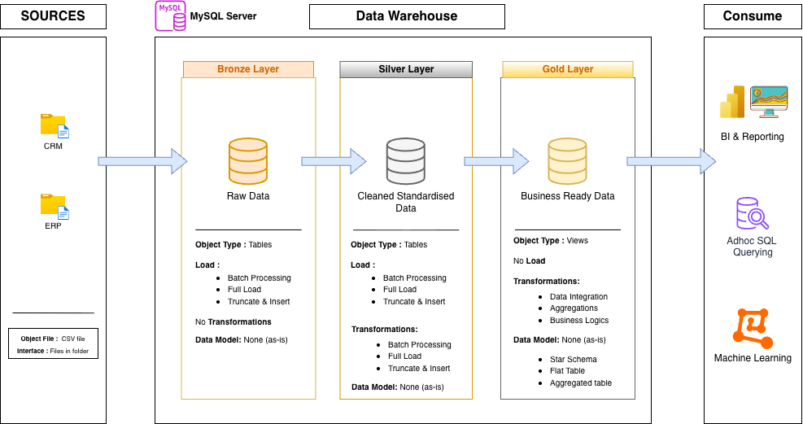

# MYSQL Data Warehouse and Analytics Project

Welcome to the **Data Warehouse and Analytics Project** repository! 🚀  
This project demonstrates a comprehensive data warehousing and analytics solution, from building a data warehouse to generating actionable insights. Designed as a portfolio project, it highlights industry best practices in data engineering and analytics.

---

## 🏗️ Data Architecture

The data architecture for this project follows Medallion Architecture **Bronze**, **Silver**, and **Gold** layers:
<!--    -->

<!--    -->

1. **Bronze Layer**: Stores raw data as-is from the source systems. Data is ingested from CSV files into a MySQL database across 6 tables from 2 source systems (CRM and ERP).
2. **Silver Layer**: Includes data cleansing, standardization, and normalization processes — handling duplicates, trimming whitespace, resolving inconsistent values, and validating date and numeric fields.
3. **Gold Layer**: Houses business-ready data modeled into a star schema with dimension and fact tables, optimized for reporting and analytics.

---

## 📖 Project Overview

This project involves:

1. **Data Architecture**: Designing a Modern Data Warehouse using Medallion Architecture **Bronze**, **Silver**, and **Gold** layers.
2. **ETL Pipelines**: Extracting, transforming, and loading data from CRM and ERP source systems into the warehouse.
3. **Data Quality**: Running structured quality checks at both the Bronze and Silver layers to ensure data integrity before promotion.
4. **Data Modeling**: Developing fact and dimension tables optimized for analytical queries.
5. **Analytics & Reporting**: Creating SQL-based reports and dashboards for actionable insights.

🎯 This repository is an excellent resource for professionals and students looking to showcase expertise in:
- SQL Development
- Data Architecture
- Data Engineering
- ETL Pipeline Development
- Data Modeling
- Data Analytics

---

## 🛠️ Important Links & Tools

Everything is Free!
- **[Datasets](datasets/):** Access to the project datasets (CSV files) for CRM and ERP source systems.
- **[MySQL Community Server](https://dev.mysql.com/downloads/mysql/):** Free, open-source relational database for hosting your data warehouse.
- **[MySQL Workbench](https://dev.mysql.com/downloads/workbench/):** GUI for managing and interacting with MySQL databases.
- **[Git Repository](https://github.com/):** Set up a GitHub account and repository to manage, version, and collaborate on your code efficiently.
- **[DrawIO](https://www.drawio.com/):** Design data architecture, models, flows, and diagrams.
- **[Notion](https://www.notion.com/):** All-in-one tool for project management and organization.

---

## 🚀 Project Requirements

### Building the Data Warehouse (Data Engineering)

#### Objective
Develop a modern data warehouse using MySQL to consolidate sales data, enabling analytical reporting and informed decision-making.

#### Specifications
- **Data Sources**: Import data from two source systems (ERP and CRM) provided as CSV files.
- **Data Quality**: Cleanse and resolve data quality issues prior to analysis.
- **Integration**: Combine both sources into a single, user-friendly data model designed for analytical queries.
- **Scope**: Focus on the latest dataset only; historization of data is not required.
- **Documentation**: Provide clear documentation of the data model to support both business stakeholders and analytics teams.

---

### BI: Analytics & Reporting (Data Analysis)

#### Objective
Develop SQL-based analytics to deliver detailed insights into:
- **Customer Behavior**
- **Product Performance**
- **Sales Trends**

These insights empower stakeholders with key business metrics, enabling strategic decision-making.

---

## 📂 Repository Structure
```
data-warehouse-project/
│
├── scripts/                            # SQL scripts for ETL and transformations
│   ├── bronze_layer.sql                # Creates Bronze schema and loads CSV data into 6 tables
│   ├── silver_layer.sql                # Creates Silver schema and applies cleansing and transformations
│   └── gold_layer.sql                  # Creates Gold schema with dimension and fact tables
│
├── tests/                              # Data quality check scripts
│   ├── quality_checks_bronze_layer.sql # Quality checks for Bronze layer tables
│   └── quality_checks_silver_layer.sql # Quality checks for Silver layer tables
│
├── documents/                          # Project documentation
│   └── data_catalog.md                 # Catalog of Gold layer tables with field descriptions
│
├── README.md                           # Project overview and instructions
└── LICENSE                             # License information for the repository
```

---

## 🔍 Data Quality Approach

Quality checks are run at two stages of the pipeline:

**Bronze Layer Checks**
- Null and duplicate detection on primary keys
- Whitespace validation across key string columns
- Date format and range validation
- Data consistency checks (e.g., `sales = quantity × price`)
- Distinct value checks for categorical fields (gender, marital status, country)

**Silver Layer Checks**
- Re-validation of all Bronze checks after transformation
- Confirming standardized values (e.g., 'M' → 'Male', 'S' → 'Single')
- Ensuring no `NAS` prefixes remain in customer IDs
- Verifying date lengths comply with the `DATE` format after conversion

---

## 🗂️ Data Model

The Gold layer is structured as a **star schema** consisting of:

- **`dwarehouse_project_gold.dim_customers`** — Customer dimension enriched with demographic and geographic data from CRM and ERP.
- **`dwarehouse_project_gold.dim_products`** — Product dimension with category and subcategory classification; active products only.
- **`dwarehouse_project_gold.fact_sales`** — Sales fact table containing transactional data linked to both dimension tables.

For full column-level documentation, refer to [`docs/data_catalog.md`](docs/data_catalog.md).

---

## 🛡️ License

This project is licensed under the [MIT License](LICENSE). You are free to use, modify, and share this project with proper attribution.
